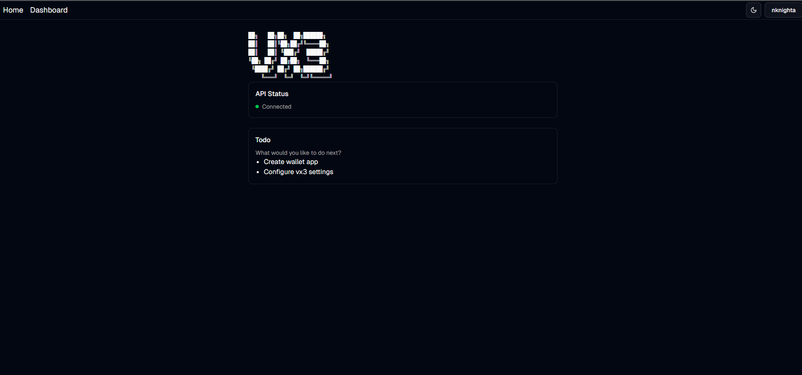

# vx3

This project was created with [Better-T-Stack](https://github.com/AmanVarshney01/create-better-t-stack), a modern TypeScript stack that combines Next.js, Next, TRPC, and more.

## Features

- **TypeScript** - For type safety and improved developer experience
- **Next.js** - Full-stack React framework
- **TailwindCSS** - Utility-first CSS for rapid UI development
- **shadcn/ui** - Reusable UI components
- **Next.js** - Full-stack React framework
- **tRPC** - End-to-end type-safe APIs
- **Node.js** - Runtime environment
- **Prisma** - TypeScript-first ORM
- **PostgreSQL** - Database engine
- **Authentication** - Better-Auth
- **PWA** - Progressive Web App support
- **Turborepo** - Optimized monorepo build system

## Getting Started

## Website ScreenShot

## owner
Nknight AMAMIYA ([@nk4dev](https://github.com/nk4dev))